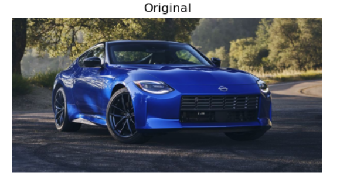
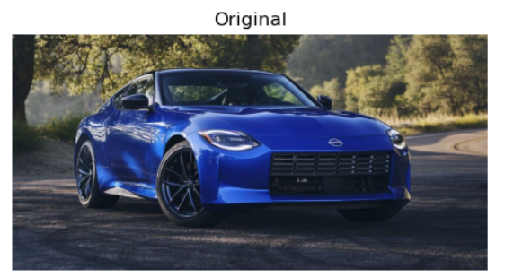
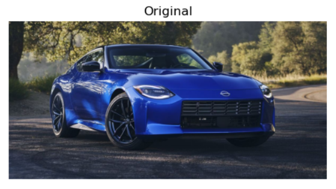
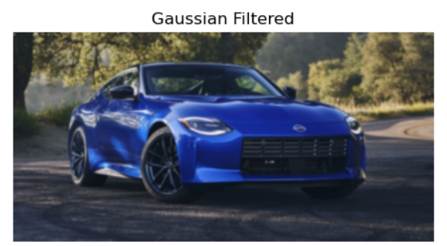
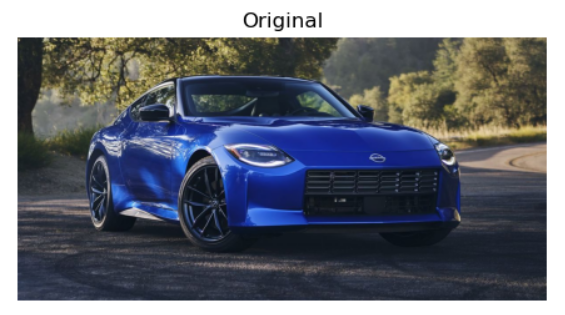
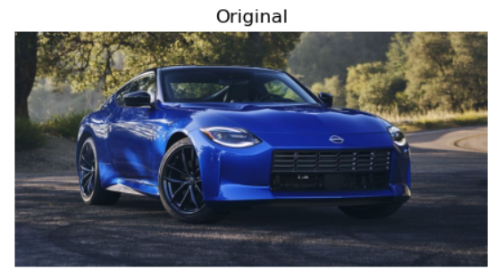
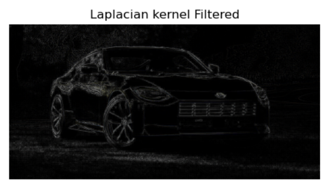
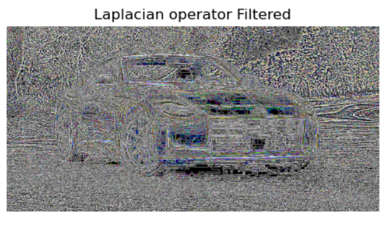

# Ex : 6 Implementation-of-Filters
## Aim:-
To implement filters for smoothing and sharpening the images in the spatial domain.

## Software Required:-
Anaconda - Python 3.7

## Algorithm:-
### Step1
Import necessary packages numpy,cv2 and matplotlib and save the image which you would like to perform Image filtering.
### Step2
Perform filtering of image.

### Step3
Perform average filter.

### Step4
Perform weighted average filter.

### Step5
Perform gaussian filter.
### Step6
Perform median filter.
### Step7
Perform Laplacian kernel filter.
### Step8
Perform Laplacian operator.
### Step9
Run the programs and execute the output.

## Program:-
### Developed By   : Sarankumar J
### Register Number: 212221230087
</br>

### 1. Smoothing Filters

i) Using Averaging Filter
```Python
import cv2
import numpy as np
import matplotlib.pyplot as plt
image1=cv2.imread("n.jpeg")
image2=cv2.cvtColor(image1,cv2.COLOR_BGR2RGB)
kernel=np.ones((9,9),np.float32)/81
image3=cv2.filter2D(image2,-1,kernel)
plt.figure(figsize = (12,12))
plt.subplot(1,2,1)
plt.imshow(image2)
plt.title('Original')
plt.axis('off')
plt.figure(figsize = (12,12))
plt.subplot(1,2,2)
plt.imshow(image3)
plt.title('Average Filtered')
plt.axis('off')
```
ii) Using Weighted Averaging Filter
```Python
import cv2
import numpy as np
import matplotlib.pyplot as plt
image1=cv2.imread("n.jpeg")
image2=cv2.cvtColor(image1,cv2.COLOR_BGR2RGB)
kernel=np.array([[1,2,1],[2,4,2],[1,2,1]])/16
image3=cv2.filter2D(image2,-1,kernel)
plt.figure(figsize = (12,12))
plt.subplot(1,2,1)
plt.imshow(image2)
plt.title('Original')
plt.axis('off')
plt.figure(figsize = (12,12))
plt.subplot(1,2,2)
plt.imshow(image3)
plt.title('Weighted average Filtered')
plt.axis('off')
```
iii) Using Gaussian Filter
```Python
import cv2
import numpy as np
import matplotlib.pyplot as plt
image1=cv2.imread('n.jpeg')
image2=cv2.cvtColor(image1,cv2.COLOR_BGR2RGB)
# Gaussian filter
gaussian_blur=cv2.GaussianBlur(src=image2,ksize=(11,11),sigmaX=0,sigmaY=0)
plt.figure(figsize = (12,12))
plt.subplot(1,2,1)
plt.imshow(image2)
plt.title('Original')
plt.axis('off')
plt.figure(figsize = (12,12))
plt.subplot(1,2,2)
plt.imshow(gaussian_blur)
plt.title('Gaussian Filtered')
plt.axis('off')
```

iv) Using Median Filter
```Python
import cv2
import numpy as np
import matplotlib.pyplot as plt
image1=cv2.imread('n.jpeg')
image2=cv2.cvtColor(image1,cv2.COLOR_BGR2RGB)
# Median Filter
median=cv2.medianBlur(src=image2,ksize=11)
plt.figure(figsize = (12,12))
plt.subplot(1,2,1)
plt.imshow(image2)
plt.title('Original')
plt.axis('off')
plt.figure(figsize = (12,12))
plt.subplot(1,2,2)
plt.imshow(median)
plt.title('Median Filtered')
plt.axis('off')
```

### 2. Sharpening Filters
i) Using Laplacian Kernal
```Python
import cv2
import numpy as np
import matplotlib.pyplot as plt
image1=cv2.imread("n.jpeg")
image2=cv2.cvtColor(image1,cv2.COLOR_BGR2RGB)
# Laplacian Kernel
kernel=np.array([[0,1,0],[1,-4,1],[0,1,0]])
image3=cv2.filter2D(image2,-1,kernel)
plt.figure(figsize = (12,12))
plt.subplot(1,2,1)
plt.imshow(image2)
plt.title('Original')
plt.axis('off')
plt.figure(figsize = (12,12))
plt.subplot(1,2,2)
plt.imshow(image3)
plt.title('Laplacian kernel Filtered')
plt.axis('off')
```
ii) Using Laplacian Operator
```Python
import cv2
import numpy as np
import matplotlib.pyplot as plt
image1=cv2.imread('n.jpeg')
image2=cv2.cvtColor(image1,cv2.COLOR_BGR2RGB)
# Laplacian operator
lap_operator=cv2.Laplacian(image2,cv2.CV_64F)
plt.figure(figsize = (12,12))
plt.subplot(1,2,1)
plt.imshow(image2)
plt.title('Original')
plt.axis('off')
plt.figure(figsize = (12,12))
plt.subplot(1,2,2)
plt.imshow(lap_operator)
plt.title('Laplacian operator Filtered')
plt.axis('off')
```

## OUTPUT:
### 1. Smoothing Filters
</br>

i) Using Averaging Filter
</br>


</br>

</br>


ii) Using Weighted Averaging Filter
</br>

</br>

</br>


iii) Using Gaussian Filter
</br>

</br>

</br>


iv) Using Median Filter
</br>

</br>

</br>


### 2. Sharpening Filters
</br>

i) Using Laplacian Kernal
</br>

</br>

</br>


ii) Using Laplacian Operator
</br>

</br>

</br>


## Result:
Thus the filters are designed for smoothing and sharpening the images in the spatial domain.
